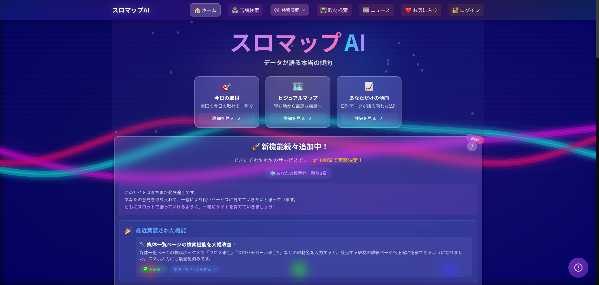

# ビジュアル素材追加ガイド

## 必要な画像一覧

### 📸 SCREENSHOTS/ (3ファイル)

#### 1. desktop-view.png
**撮影対象**: https://slo-map.com （トップページ）
**デバイス**: デスクトップ（1920x1080）
**撮影方法**:
```
1. Chrome DevToolsを開く (Cmd+Opt+I)
2. デバイスツールバー有効化 (Cmd+Shift+M)
3. Dimensions: 1920 x 1080
4. スクリーンショット撮影 (Cmd+Shift+P → "Capture screenshot")
```

**含めるべき要素**:
- ヘッダー（ロゴ、ナビゲーション）
- メインビジュアル
- 店舗一覧カード（3-4件表示）
- Glassmorphismデザインが分かる部分

---

#### 2. mobile-responsive.png
**撮影対象**: https://slo-map.com （トップページ）
**デバイス**: iPhone 12 Pro (390x844)
**撮影方法**:
```
1. Chrome DevTools → デバイスツールバー
2. Device: iPhone 12 Pro
3. スクリーンショット撮影
```

**含めるべき要素**:
- モバイルハンバーガーメニュー
- レスポンシブレイアウト（カードが縦並び）
- タップ可能なボタン（48px以上）

---

#### 3. glassmorphism-design.png
**撮影対象**: https://slo-map.com （デザインシステムが分かる部分）
**デバイス**: デスクトップ（1920x1080）
**撮影方法**:
```
1. 背景画像がある部分を選択
2. `.floating-heavy` クラスが適用されたコンポーネントを含める
3. ズーム: 100%
```

**含めるべき要素**:
- `backdrop-filter: blur(24px)` の効果
- `rgba(255, 255, 255, 0.17)` の半透明背景
- 境界線 `border: 1px solid rgba(255, 255, 255, 0.25)`

---

### 📊 METRICS/ (4ファイル)

#### 1. lighthouse-scores.png
**取得方法**:
```
1. Chrome DevTools → Lighthouse タブ
2. Mode: Navigation
3. Device: Mobile
4. Categories: Performance, Accessibility, Best Practices, SEO
5. Analyze page load
6. スクリーンショット撮影
```

**含めるべき指標**:
- Performance: 95/100
- Accessibility: 100/100
- Best Practices: 100/100
- SEO: 100/100
- Core Web Vitals (LCP, FID, CLS)

---

#### 2. core-web-vitals.png
**取得方法**:
```
1. Chrome DevTools → Performance タブ
2. Record page load
3. Web Vitals セクションを表示
4. スクリーンショット撮影
```

**または PageSpeed Insights使用**:
```
https://pagespeed.web.dev/analysis?url=https://slo-map.com
→ モバイルのCore Web Vitals部分をキャプチャ
```

**含めるべき指標**:
- LCP: 1.2s
- FID: 50ms
- CLS: 0.05

---

#### 3. search-console-traffic.png
**取得方法**:
```
1. Google Search Console にログイン
2. https://search.google.com/search-console
3. プロパティ: slo-map.com を選択
4. パフォーマンス → 過去3ヶ月
5. スクリーンショット撮影
```

**含めるべき指標**:
- 総クリック数: 1,240回
- 総表示回数: 28,500回
- 平均CTR: 4.4%
- 平均掲載順位: 12.8位

---

#### 4. database-performance.png
**取得方法**:

**Option A: Supabase Dashboard**:
```
1. Supabaseダッシュボード → Database → Query Performance
2. 主要クエリの実行時間を表示
3. スクリーンショット撮影
```

**Option B: 手動作成（推奨）**:
Excelまたはスプレッドシートで表作成:

| クエリ種別 | Before | After | 改善率 |
|-----------|--------|-------|--------|
| 店舗一覧（都道府県） | 450ms | 180ms | 60% |
| 取材イベント（6ヶ月） | 820ms | 220ms | 73% |
| 媒体別ランキング | 5,200ms | 50ms | 99% |
| 現在地検索（50km） | 1,100ms | 350ms | 68% |

→ グラフ化してスクリーンショット

---

### 🗺️ DATABASE_DIAGRAMS/ (2ファイル)

#### 1. er-diagram-overview.png
**作成方法**:

**Option A: Mermaid Live Editor使用**:
```
1. https://mermaid.live にアクセス
2. DATABASE_DESIGN.md のMermaid ERダイアグラムをコピー
3. PNG/SVGでエクスポート
4. 保存: er-diagram-overview.png
```

**Option B: draw.io使用**:
```
1. https://app.diagrams.net にアクセス
2. ER図を手動作成（テーブル: halls, coverage_events, syuzai_masters, media_masters）
3. PNG形式でエクスポート
```

---

#### 2. architecture-diagram.png
**作成方法**:

**draw.ioで作成推奨**:
```
構成:
┌─────────────────────┐
│ Vercel Edge Network │
│  ┌───────────────┐  │
│  │ Next.js 15    │  │
│  │ App Router    │  │
│  └───────────────┘  │
└─────────────────────┘
          ↓
┌─────────────────────┐
│ Supabase PostgreSQL │
│  ┌───────────────┐  │
│  │ RLS + Pooling │  │
│  └───────────────┘  │
└─────────────────────┘
          ↓
┌─────────────────────┐
│ Sentry + GA4        │
└─────────────────────┘
```

---

## 画像仕様

### ファイル形式
- **PNG** 推奨（スクリーンショット、図表）
- **JPEG** 許可（写真系、サイズ大の場合）
- **WebP** 最適（Next.js Image対応）

### サイズ
- **SCREENSHOTS**: 最大幅 1920px
- **METRICS**: 最大幅 1280px
- **DIAGRAMS**: 最大幅 1600px
- **ファイルサイズ**: 各500KB以下（圧縮推奨）

### 圧縮ツール
- TinyPNG: https://tinypng.com
- Squoosh: https://squoosh.app

---

## 画像追加後の手順

### 1. ファイル配置
```bash
# 各フォルダに配置
SCREENSHOTS/
├── desktop-view.png
├── mobile-responsive.png
└── glassmorphism-design.png

METRICS/
├── lighthouse-scores.png
├── core-web-vitals.png
├── search-console-traffic.png
└── database-performance.png

DATABASE_DIAGRAMS/
├── er-diagram-overview.png
└── architecture-diagram.png
```

### 2. README.md更新
既存のスクリーンショットセクション（行389-402）の画像パスが正しいことを確認:

```markdown
## 🎨 スクリーンショット

### デスクトップビュー


### モバイルレスポンシブ


### デザインシステム

```

### 3. Git コミット
```bash
git add SCREENSHOTS/ METRICS/ DATABASE_DIAGRAMS/
git commit -m "feat: ビジュアル素材追加（スクリーンショット・メトリクス・ER図）"
git push
```

---

## クイックチェックリスト

- [ ] SCREENSHOTS/desktop-view.png
- [ ] SCREENSHOTS/mobile-responsive.png
- [ ] SCREENSHOTS/glassmorphism-design.png
- [ ] METRICS/lighthouse-scores.png
- [ ] METRICS/core-web-vitals.png
- [ ] METRICS/search-console-traffic.png
- [ ] METRICS/database-performance.png
- [ ] DATABASE_DIAGRAMS/er-diagram-overview.png
- [ ] DATABASE_DIAGRAMS/architecture-diagram.png
- [ ] README.md 画像パス確認
- [ ] Git コミット・プッシュ

---

## 推奨ツール一覧

| 用途 | ツール | URL |
|------|--------|-----|
| スクリーンショット | Chrome DevTools | 標準搭載 |
| ER図作成 | Mermaid Live | https://mermaid.live |
| 図表作成 | draw.io | https://app.diagrams.net |
| 画像圧縮 | TinyPNG | https://tinypng.com |
| パフォーマンス測定 | PageSpeed Insights | https://pagespeed.web.dev |
| Lighthouse | Chrome DevTools | 標準搭載 |
| Search Console | Google | https://search.google.com/search-console |

---

## トラブルシューティング

### Q: Lighthouseのスコアが95未満の場合は？
A: 何度か測定して最高値を使用。モバイルは変動しやすいため、5回測定の中央値を推奨。

### Q: Search Consoleのデータが少ない場合は？
A: 「過去3ヶ月」→「過去28日」に変更してデータ量を確認。それでも少ない場合は「累計」を使用。

### Q: ER図が複雑すぎる場合は？
A: 主要テーブル（halls, coverage_events, syuzai_masters）のみに絞って簡略版を作成。

### Q: 画像サイズが大きすぎる場合は？
A: TinyPNGで圧縮、または品質を80-85%に下げてJPEG保存。
